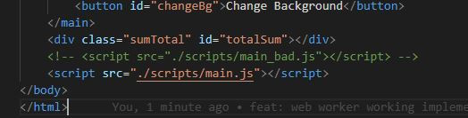

# Learn Web-woker basic example

### How to run
Clone it and then run your application by using http-server command. If its not in your machine then you
can install it from:
```
npm i http-server
```

### First run without web-worker. Basic version
To run this first uncomment the main_bad.js from index.html. As shown in image


Here when you click on Calculate button and then change background button. You will observe the page gets hanged and nothing is
happening, till the calculation not completed. This is because Javascript runs on single thread and until the whole calculation
not completed all other tasks gets queued. Once calculation is done then your background will change. Here you will face the 
demerit of single threaded Javascript.